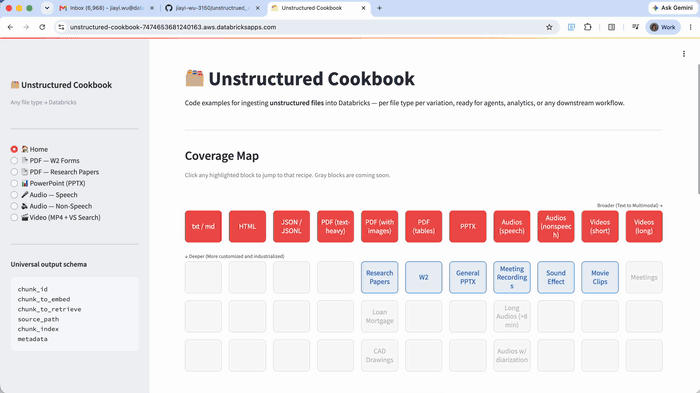

# Unstructured Cookbook

A recipe book for ingesting any unstructured file type into Databricks — ready for RAG, vector search, agents, and analytics.

Each recipe covers one file type end-to-end: raw file in a Unity Catalog Volume → parsed chunks → Vector Search index.

**Live app:** https://unstructured-cookbook-7474653681240163.aws.databricksapps.com (Currently Internal)



---

## Universal Output Schema

Every recipe produces a table with this canonical schema:

| Column | Description |
|---|---|
| `chunk_id` | Unique identifier for each chunk |
| `chunk_to_embed` | Text or base64 content sent to the embedding model |
| `chunk_to_retrieve` | Human-readable text returned in search results |
| `source_path` | UC Volume path of the source file |
| `chunk_index` | Position of the chunk within the source file |
| `metadata` | JSON — file-specific fields (speaker, frame_num, slide title, etc.) |

---

## Recipes

| # | File Type | Parser | Table | Notes |
|---|---|---|---|---|
| 01 | PDF — W2 Forms | `ai_parse_document` | `w2_parsed` | Structured field extraction |
| 02 | PDF — Research Papers | `ai_parse_document` + Gemini figure descriptions | `research_parsed` | Text + AI-written figure captions |
| 03 | PowerPoint (PPTX) | `ai_parse_document` | `pptx_chunks` | One chunk per slide |
| 04 | Audio — Speech | Whisper Large v3 | `voice_celebrities_chunks` | Word-window chunks with speaker context |
| 05 | Audio — Non-Speech | Gemini 2.5 Flash | `sound_chunks` | Classify + describe sound effects and music |
| 06 | Video (MP4) | CLIP + Gemini 2.5 Flash | `video_clips_gold` | Frame embeddings (768-dim) + descriptions |

---

## Pipeline Architecture

```
Raw file (UC Volume)
  └─► ai_parse_document / Whisper / CLIP / Gemini
        └─► parsed_raw table  (VARIANT / raw output)
              └─► parsed table  (exploded elements)
                    └─► chunks table  (canonical schema)
                          └─► Vector Search index  (embed + sync)
```

---

## Repo Structure

```
notebooks/          # One .py notebook per recipe (run as Databricks jobs)
app/                # Streamlit app — browse and search all recipes
  app.py            # Entry point
  views/            # One view per recipe
  utils/            # DB connection + formatting helpers
  app.yaml          # Databricks Apps config
model_setup/        # CLIP model registration + GPU endpoint setup
docs/               # Architecture diagrams per recipe
databricks.yml      # Databricks Asset Bundle config
deploy.sh           # Deploy script for the Databricks App
```

---

## Setup

### Prerequisites
- Databricks workspace with Unity Catalog
- Serverless compute enabled
- Model serving (GPU endpoint for CLIP, serverless for Gemini/Whisper)

### Run a recipe notebook

```bash
databricks jobs create --json @notebooks/06_video.py
databricks jobs run-now --job-id <id>
```

### Run the app locally

```bash
pip install -r app/requirements.txt
DATABRICKS_TOKEN=<pat> DATABRICKS_HOST=<workspace-host> streamlit run app/app.py
```

### Deploy to Databricks Apps

```bash
bash deploy.sh
```

---

## Workspace

- **Host:** `fevm-serverless-stable-r4umw1.cloud.databricks.com`
- **Catalog:** `serverless_stable_r4umw1_catalog`
- **Schema:** `unstructured_data`
