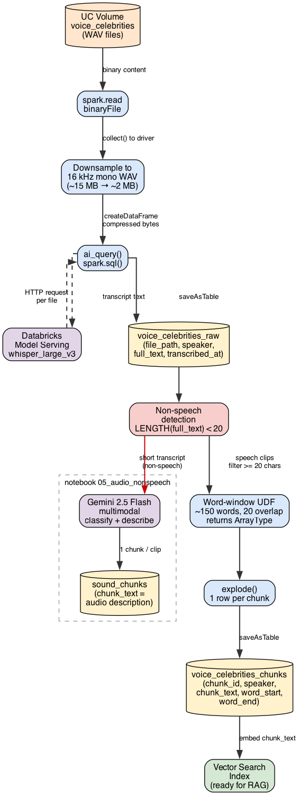

# 04 — Audio Parsing: Speech Transcription with Whisper

Transcribes celebrity voice clips from a UC Volume using the `whisper_large_v3`
Databricks Model Serving endpoint and produces embedding-ready chunks.

## Architecture

## Pipeline steps

| Step | What happens |
|------|-------------|
| 1 | List WAV files in UC Volume `voice_celebrities` |
| 2 | Collect files to driver, downsample to 16 kHz mono (15 MB → 2 MB), call `ai_query('whisper_large_v3')`, save to `voice_celebrities_raw` |
| 3 | Flag non-speech clips: `LENGTH(full_text) < 20` or Whisper hallucination tags (`[ Music ]`, `[ Silence ]`) |
| 4 | Word-window chunking (~150 words, 20-word overlap) → `voice_celebrities_chunks` |
| 5 | Inspect transcripts and chunk distribution |
| 6 | Play original audio inline and compare against transcript + chunks |

## Tables

### `voice_celebrities_raw`
One row per audio file.

| Column | Type | Description |
|--------|------|-------------|
| `file_path` | STRING | Full UC Volume path to the WAV file |
| `speaker` | STRING | Speaker name derived from filename |
| `full_text` | STRING | Full Whisper transcript |
| `transcribed_at` | TIMESTAMP | When transcription ran |

### `voice_celebrities_chunks`
One row per chunk, ready for embedding.

| Column | Type | Description |
|--------|------|-------------|
| `chunk_id` | STRING | `<file_path>::<chunk_index>` |
| `file_path` | STRING | Source file |
| `speaker` | STRING | Speaker name |
| `chunk_index` | INT | Chunk sequence number (0-based) |
| `chunk_text` | STRING | `[Speaker: Name] <text>` — prefixed for retrieval context |
| `word_start` | INT | First word index in the full transcript |
| `word_end` | INT | Last word index in the full transcript |

## Key design decisions

**Why downsample before `ai_query`?**
`ai_query` has a 16 MB request limit. Uncompressed WAV files from the
`voice_celebrities` dataset are ~15 MB each. Downsampling to 16 kHz mono
(Whisper's native format) reduces each file to ~2 MB with no quality loss
for transcription.

**Why collect to driver instead of a UDF?**
For small datasets (≤ a few hundred files), collecting to the driver for
compression then creating a new DataFrame is simpler and avoids pandas UDF
length constraints. For large datasets, use `mapInPandas` instead.

**Why word-window chunking instead of time-based?**
`ai_query` returns the full transcript text without per-segment timestamps.
Word-window chunking with overlap is the simplest text-based alternative.
If you need timestamps, use the `faster-whisper` UDF approach (see note below).

**Non-speech handling**
Clips where `LENGTH(full_text) < 20` or the transcript contains Whisper
hallucination patterns are flagged. Route these to
[notebook 05](05_audio_nonspeech.md) for Gemini description.

## Whisper vs faster-whisper tradeoff

| | `ai_query` (this notebook) | `faster-whisper` UDF |
|--|--|--|
| Setup | None — uses Model Serving endpoint | `%pip install faster-whisper` + `download_root="/tmp"` |
| Timestamps | ✗ Not available | ✓ Per-segment `start`/`end` |
| `no_speech_prob` | ✗ Not available | ✓ Per-segment (reliable non-speech detection) |
| Scale | Spark-native, parallelises automatically | Pandas UDF, scales across workers |
| File size limit | 16 MB per request (downsample needed for large WAV) | No limit |

Use `faster-whisper` when you need timestamps or reliable non-speech
probability scores. Use `ai_query` for simplicity when the dataset is
reasonably sized and speech-only.

## Mixed speech / non-speech datasets

When your dataset contains a mix of speech and non-speech audio:

1. **Run Whisper first** (cheaper) — flag clips with short transcripts or
   hallucination tags as non-speech
2. **Route flagged clips to Gemini** (notebook 05) for classification and description

This is preferred unless your dataset is majority non-speech, in which case
a Gemini-first classification pass may save overall cost.

## Source data

- **Dataset**: [`sdialog/voices-celebrities`](https://huggingface.co/datasets/sdialog/voices-celebrities) (HuggingFace)
- **Volume**: `serverless_stable_r4umw1_catalog.unstructured_data.voice_celebrities`
- **Format**: WAV, 13 files, ~197 MB total
