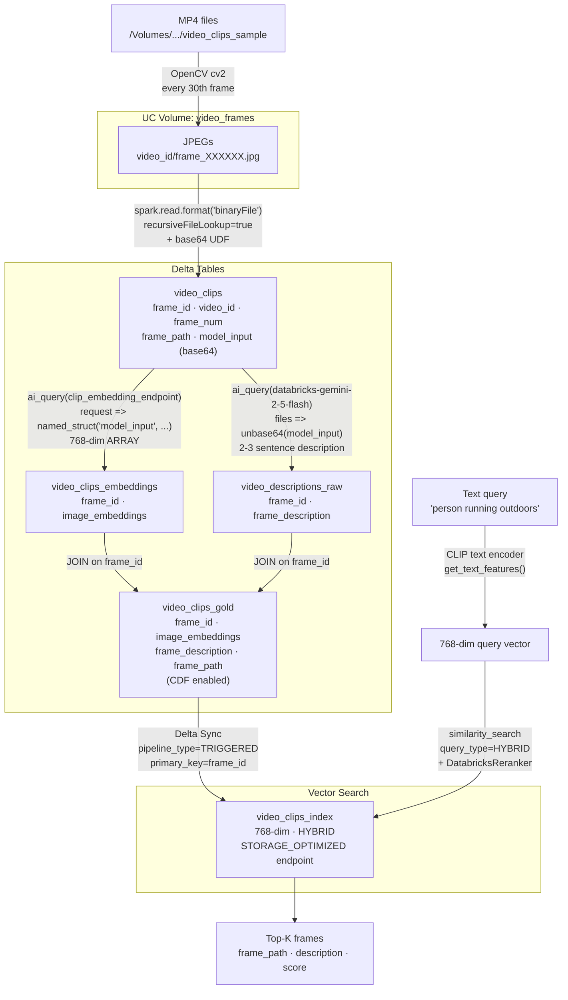

# 06 — Video (MP4): Frame Extraction, CLIP Embeddings & Multimodal Search

Processes MP4 video files into a cross-modal Vector Search index. A text query like
`"person running outdoors"` finds the most visually similar video frames — no per-frame
labels required — because CLIP image and text embeddings share the same 768-dim space.

---

## Architecture

> Diagram source: [diagrams/06_video_architecture.mmd](diagrams/06_video_architecture.mmd)

---

## Pipeline Steps

| Step | What it does | Output table / resource |
|------|-------------|------------------------|
| 1 | List MP4s in source volume | — |
| 2 | OpenCV frame extraction → JPEGs saved to `video_frames` volume; binaryFile read → base64 UDF | `video_clips` |
| 3 | CLIP embedding via `ai_query(clip_embedding_endpoint)` | `video_clips_embeddings` |
| 4 | Gemini 2.5 Flash multimodal description via `ai_query` | `video_descriptions_raw` |
| 5 | JOIN embeddings + descriptions + frame_path | `video_clips_gold` (CDF on) |
| 6 | Create VS endpoint + Delta Sync index | `video-search-endpoint` / `video_clips_index` |
| 7 | Smoke test: SQL inspection + hybrid text search | — |
| 8 | Optional: per-video LLM summary | — |

---

## Prerequisites

| Requirement | Details |
|-------------|---------|
| CLIP endpoint | `clip_embedding_endpoint` must be **READY** — run `model_setup/clip_model.py` first |
| Gemini endpoint | `databricks-gemini-2-5-flash` — available via FMAPI on this workspace |
| DBR / Serverless | Serverless env ≥ 3 (for `ai_query` multimodal `files =>`) |
| Source volume | MP4/AVI/MOV/MKV files in `/Volumes/{CATALOG}/{SCHEMA}/video_clips_sample` |

---

## Output Schema

### `video_clips` — raw frame table
| Column | Type | Description |
|--------|------|-------------|
| `frame_id` | STRING | `"{video_id}::{frame_num}"` — primary key |
| `clip_id` | INT | Row number (monotonic) |
| `video_id` | STRING | Filename stem, e.g. `Breakfas1939_512kb` |
| `frame_num` | INT | Frame index in source video |
| `frame_path` | STRING | `/Volumes/.../video_frames/{video_id}/frame_XXXXXX.jpg` |
| `model_input` | STRING | Base64-encoded JPEG (input to CLIP endpoint) |

### `video_clips_gold` — search-ready table
| Column | Type | Description |
|--------|------|-------------|
| `frame_id` | STRING | Primary key |
| `video_id` | STRING | Source video |
| `frame_num` | INT | Frame position |
| `image_embeddings` | ARRAY\<DOUBLE\> | 768-dim CLIP embedding |
| `frame_description` | STRING | Gemini 2.5 Flash natural-language description |
| `frame_path` | STRING | Volume path to the JPEG file |

---

## Key Design Decisions

**Frame storage: save to volume, read with `binaryFile`**
`cv2.imwrite()` saves each frame as a JPEG under `video_frames/{video_id}/`, then
`spark.read.format("binaryFile").option("recursiveFileLookup", "true")` loads them.
This gives `path` as a first-class column for free and keeps the base64 conversion
Spark-native (UDF on `content` BINARY).

**Why `model_input` is a base64 STRING (not BINARY)**
The CLIP pyfunc endpoint expects a STRING column named `model_input`. Storing base64
STRING avoids a conversion at embedding time. Gemini's `files =>` needs BINARY, so
`unbase64(model_input)` converts inline in the SQL.

**Why CLIP for embeddings, not `ai_parse_document`**
`ai_parse_document` returns text descriptions of image elements — not dense embeddings.
CLIP provides a continuous 768-dim space shared by images and text, enabling
cross-modal search without per-frame labels. Use `ai_parse_document` for OCR
extraction; use CLIP for semantic visual similarity.

**Driver-side extraction (small datasets)**
For a few MP4 files, OpenCV on the driver is simpler than a distributed UDF.
For 100+ videos, switch to `mapInPandas` to distribute extraction across workers.

---

## Scaling Notes

| Dataset size | Recommended change |
|-------------|-------------------|
| 1–10 videos | Driver-side extraction (current) |
| 10–1000 videos | `mapInPandas` UDF for parallel extraction |
| 1000+ videos | Spark binary read + distributed UDF + streaming ingest |
| Large frames | Reduce JPEG quality in `cv2.imwrite` (`[cv2.IMWRITE_JPEG_QUALITY, 80]`) |
| Denser sampling | Decrease `FRAME_INTERVAL` (30 = ~1 fps at 30 fps source) |

---

## Known Gotchas

- `spark.read.format("binaryFile")` is **not recursive by default** — must set `option("recursiveFileLookup", "true")` when frames are in `{video_id}/` subdirectories.
- `ai_query` `files =>` expects **`BINARY`** (not `ARRAY<BINARY>`) — use `files => unbase64(model_input)`, not `files => array(unbase64(model_input))`.
- VS endpoint creation takes **15–20 min** first time. Step 7 polls up to 20 min.
- Pin `numpy<2.0` in `%pip install` to avoid pandas binary incompatibility on serverless.
- `%pip install` and `%restart_python` in Step 7 require re-defining `VS_ENDPOINT` / `VS_INDEX` constants after the kernel restart.
